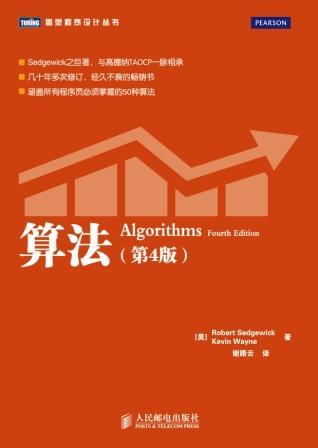

# algorithms-sedgewick-wayne-javascript
> Javascript's solutions  to the exercises of the Algorithms book by Robert Sedgewick and Kevin Wayne(4th editon).

> 算法第四版习题答案，JavaScript描述版本

I found the book to be an excellent resource to learning algorithms and data structures. Since there are not many (almost none) solutions of the exercises on the Internet and the only ones available are incomplete, I decided to share my work on the exercises. Hopefully this will help students and professionals to validate their exercise solutions and learn more about the book content.

And as a JavaScript-developer, I decided to use JavaScript finash this work. So if you can not get some exervises's solutions which is only for Java Language.

Finally, I finash Unit Testing for this. It can provide these solutions are broadly correct.

To the best of my knowledge, 
If you find anything incorrect feel free to create an issue or to open a pull request.

我发现这本书是学习算法和数据结构的绝佳资源。由于课后习题在网上的答案并不多（几乎没有），而且仅有的解决方案也不完整，所以我决定分享我的练习成果。希望这将有助于学生和专业人士验证他们的锻炼解决方案，并了解更多的书籍内容。

并且作为一个前端工程师，我将用JavaScript来完成这个练习。所以对于一些只可用Java解答的习题的答案这里是找不到的（通常是Java语法相关，第一章居多）

最后我想说的是，我为此编写了单元测试，这可以证明我的解答基本上是正确的。

如果发现任何错误，请提issues给我。

